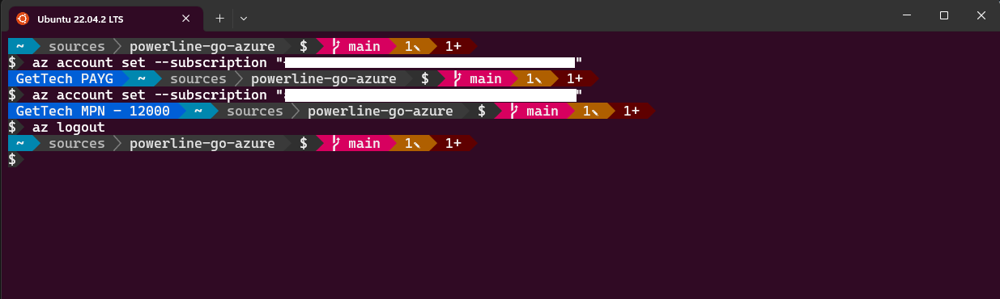

# Azure powerline-go module for your prompt, written in go. Adds the name of the active Azure subscription to your prompt.

A [powerline-go](https://github.com/justjanne/powerline-go) module that adds information about the active Azure subscription to your prompt.



- Shows the name of the active Azure subscription, if any.

## Installation

Tested with powerline-go v1.24 and azure-cli v2.51.0.

Download the precompiled binary and put it somewhere into your path and add the module to your powerline-go prompt.

- bash

    ```bash
    function _update_ps1() {
        PS1="$($GOPATH/bin/powerline-go -error $? -jobs $(jobs -p | wc -l) -modules azure,cwd,perms,exit,root -modules-right git -newline)"
    }
    if [ "$TERM" != "linux" ] && [ -f "$GOPATH/bin/powerline-go" ]; then
        PROMPT_COMMAND="_update_ps1; $PROMPT_COMMAND"
    fi
    ```

- powerhsell

    ```powershell
    function global:prompt {
        $pwd = $ExecutionContext.SessionState.Path.CurrentLocation
        $startInfo = New-Object System.Diagnostics.ProcessStartInfo
        $startInfo.FileName = "powerline-go"
        $startInfo.Arguments = "-shell bare -modules azure,cwd,perms,exit,root -modules-right git -newline"
        $startInfo.Environment["TERM"] = "xterm-256color"
        $startInfo.CreateNoWindow = $true
        $startInfo.StandardOutputEncoding = [System.Text.Encoding]::UTF8
        $startInfo.RedirectStandardOutput = $true
        $startInfo.UseShellExecute = $false
        $startInfo.WorkingDirectory = $pwd
        $process = New-Object System.Diagnostics.Process
        $process.StartInfo = $startInfo
        $process.Start() | Out-Null
        $standardOut = $process.StandardOutput.ReadToEnd()
        $process.WaitForExit()
        $standardOut
    }
    ```

### Precompiled Binaries

The precompiled binaries are available at the [releases tab](https://github.com/GetTech-io/powerline-go-azure/releases)

### From Source

```bash
go install github.com/GetTech-io/powerline-go-azure@latest
```

